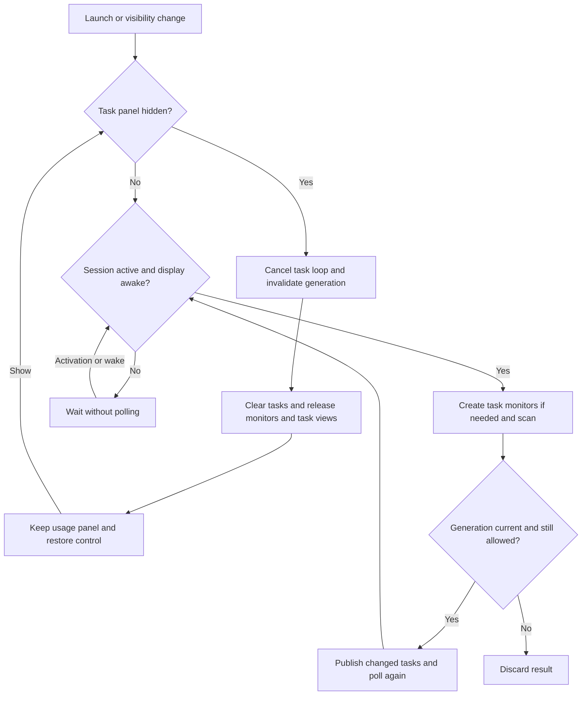

# Codex Pulse

<p align="center">
  <a href="README.md">English</a> ·
  <a href="README.zh-CN.md">简体中文</a> ·
  <a href="README.zh-HK.md">繁體中文（香港）</a> ·
  <a href="README.zh-TW.md">繁體中文（台灣）</a> ·
  <strong>日本語</strong> ·
  <a href="README.ko.md">한국어</a>
</p>

Codex Pulse は、Dock のそばにローカルの Codex、Claude Code、OpenCode の使用量とタスクアクティビティを表示する macOS 26+ のデスクトップアクセサリです。SwiftUI と AppKit で構築され、使用量データをアップロードしたり元の記録を変更したりせず、ローカルの記録を読み取ります。

<p align="center">
  <a href="https://iwecon.github.io/CodexPulse/">
    
  </a>
</p>

[製品ページとインタラクティブデモ](https://iwecon.github.io/CodexPulse/) · [リリースをダウンロード](https://github.com/iwecon/CodexPulse/releases/latest)

## インストール

macOS 26 以降では、Releases から Mac に合う DMG をダウンロードします。Apple シリコン向けは `Codex-Pulse-arm64.dmg`、Intel 向けは `Codex-Pulse-x86_64.dmg` です。DMG を開き、`Codex Pulse.app` を Applications にコピーします。

Homebrew がインストールされていれば、このリポジトリの Tap を使えます。

```bash
brew tap iwecon/codex-pulse https://github.com/iwecon/CodexPulse
brew install --cask iwecon/codex-pulse/codex-pulse
```

別のインストーラを使うには、Node.js 18+ と npm が必要です。

```bash
npm install -g github:iwecon/CodexPulse
codex-pulse install
codex-pulse open
```

npm コマンドはどのディレクトリからでも実行できます。CLI だけをインストールしてもアプリはインストールされません。`codex-pulse install` はリリース DMG をダウンロードしてマウントし、アプリを `~/Applications/Codex Pulse.app` にコピーします。既存のインストールを置き換えるには `--force` を追加します。サポートされているコマンドは [インストーラー CLI](npm/bin/codex-pulse.js) を参照してください。

## パネルを使う

複数のディスプレイを接続している場合、両方のパネルはシステムのメインディスプレイに固定され、ポインタやフォーカス中のウインドウを追って移動しません。メインディスプレイの変更やディスプレイの接続・切断時には、配置が自動的に更新されます。

アプリには Dock アイコンがありません。透明なパネルはデスクトップアイコンより上、通常のアプリウインドウより下に留まり、Dock が下・左・右のどこにあっても追従し、複数の Spaces に対応します。

| パネル | 表示内容 |
| --- | --- |
| **Usage Overview Panel** (`用量概览面板`) | ローリング 14 日間の Token 使用傾向とツールごとの合計、利用可能な場合は Codex の週間クォータを表示します。その期間に使用量がないツールは自動的に非表示になります。 |
| **Task Activity Panel** (`任务活动面板`) | 3 つすべてのツールのアクティブなタスクと最近のタスクを、プロジェクトとセッションごとにまとめ、ステータスインジケータと最新のユーザーメッセージを表示します。 |

デフォルトでは、下部 Dock の左側に使用量、右側にタスクが表示されます。Dock が縦の場合は、使用量がタスクの上に表示されます。パネルを移動しても、これらの名前が表す役割は変わりません。

パネル内でポインタを半秒間止めると、コントロールが表示されます。リサイズ端をドラッグするかボタンを使って、パネルの移動と重なり順の変更ができます。Usage Overview Panel には言語選択、ツールごとのバー色、週間クォータの表示、Photos の壁紙アクセス許可もあります。Task Activity Panel にはテキスト配置と非表示ボタンがあります。設定はローカルに保存されます。インターフェースは簡体字中国語、香港・台湾の繁体字中国語、日本語、韓国語、英語に対応し、初期設定は簡体字中国語です。

通常のコンテンツはクリックを通過します。Codex のセッションタイトルをクリックすると対応する ChatGPT の会話が開きます。Claude Code と OpenCode のタイトルはクリックを通過します。テキストは各パネル下の壁紙に合わせて変化します。サンプリングにはローカルのアセットだけを使い、画面キャプチャは行いません。Photos ライブラリの壁紙は既存のアクセス権を使い、コントロールから明示的に許可を求めた場合に限り許可を要求します。利用できない壁紙アセットは画像をダウンロードせず、システム外観にフォールバックします。

ローカルのクォータスナップショットを提供するのは Codex だけです。残りのクォータは、最新のアカウントレベルのレコードを使って `100 - used_percent` として求めます。フッターの週間 Token 合計は推定値です。計算は `tokens recorded in the quota window ÷ used_percent × 100` で、生の消費率を使います。公式の Token 利用可能量ではなく、他のデバイスやクラウドセッションのアクティビティが含まれない場合があります。入力がない、または無効な場合は使用済み分だけを表示します。説明を見るには週間クォータ表示コントロールにポインタを合わせてください。

ログアクティビティが 3 分間ない Codex ターンは一時停止として表示され、最後のアクティビティから 10 分後に期限切れになります。新しいアクティビティで再開するのは、ログ出力がない状態から推定された一時停止だけです。完了したタスク、明示的に一時停止したタスク、終了したタスクは 10 分間残ります。Claude Code と OpenCode はローカル記録からターンを推定し、セッションが 12 分を超えて非アクティブな実行中ターンを削除します。そのため、長時間ログ出力のないツール呼び出しは一時的に一時停止と表示されたり、消えたりすることがあります。

非 Debug の `.app` は初回起動時にログイン時の起動を設定し、後からシステム設定で無効にした状態を尊重します。Debug ビルドと生の実行ファイル（`swift run` を含む）はログイン項目を変更しません。

## ローカルデータと更新

サポートされているツールを標準のローカルデータ場所で使っていれば、API キーやソースの設定は必要ありません。

| ソース | 読み取るレコード |
| --- | --- |
| Codex の使用量 | `~/.codex/sessions/**/*.jsonl`, `~/.codex/archived_sessions/**/*.jsonl` |
| Codex のタスクインデックス | `~/.codex/state_*.sqlite` と、そこから参照されるセッションログ |
| Claude Code の使用量とタスク | `~/.claude/projects/**/*.jsonl` |
| OpenCode の使用量とタスク | `~/.local/share/opencode/opencode.db`（WAL/SHM の変更検出を含む） |

ソースがない、または読み取れない場合、そのツールだけが影響を受けます。使用量の集計は表示対象の 14 日間を対象とし、派生データはメモリ内だけに保持します。コールドスキャンでは関係するファイルと行を絞り込み、その後のスキャンではメモリ内の状態を再利用して追加や変更だけを処理します。JSONL はチャンク単位で読み取り、派生した使用量データベースやディスクキャッシュは作成しません。セッションが非アクティブな間やディスプレイがスリープ中は、使用量とタスクの更新、およびタスクステータスのアニメーションを停止します。両方の条件が解除されると再開します。

### タスクアクティビティを非表示にして復元する

コントロールで **タスクアクティビティパネルを非表示** を選び、復元するときは Usage Overview Panel で **タスクアクティビティパネルを表示** を選びます。非表示設定は起動後も保持され、タスク監視をキャンセルし、タスクを消去し、キャンセルされた読み取りが終了した後にタスク専用キャッシュを解放します。また、タスクビュー、リンク、コントロール、壁紙サンプリング領域も削除します。使用量スキャンは独立して動作し、同じログを読み取る場合があります。復元してもパネル設定は維持され、現在の記録をスキャンします。非表示中の時間も期限に算入されます。



[UsageModel.swift](Sources/CodexPulse/UsageModel.swift) は更新の可否と世代管理を、[TaskMonitoringSession.swift](Sources/CodexPulse/TaskMonitoringSession.swift) は 3 つのタスク監視を管理します。非表示で起動した場合、タスク監視は開始されません。オブジェクトを解放しても、再利用可能なアロケータページがプロセスのフットプリントから直ちに消えるとは限りません。

## 開発と検証

macOS 26+、Xcode 26+ と選択した Swift 6.2+ ツールチェーン、システムの SQLite 3 ライブラリを使用してください。[Swift パッケージ](Package.swift) に外部パッケージ依存関係はありません。次のコマンドをリポジトリルートから実行します。

```bash
swift build
swift run "Codex Pulse"
swift test
```

Debug `.app` の場合は、リポジトリルートから `./script/build_and_run.sh` を使います。既存の `Codex Pulse` プロセスを停止し、`dist/Codex Pulse Debug.app` を再ビルドして起動します。このスクリプトは `--debug`、`--logs`、`--telemetry`、`--verify` にも対応しています。詳細は[スクリプト](script/build_and_run.sh)を参照してください。

[テストスイート](Tests/CodexPulseTests) は、パーサー、増分スキャン、クォータ計算、タスクライフサイクル、パネルのジオメトリ、壁紙の動作、ローカライズ、ログイン時起動の適格性を対象とします。[AGENTS.md](AGENTS.md) にはプロジェクト固有の制約と、全スイートまたは UI・メモリチェックが必要になる変更が記載されています。

ローカルセッションを対象に、オプトインで読み取り専用のタスクメモリチェックを行うには、リポジトリルートから次を実行します。

```bash
CODEXPULSE_LOCAL_TASK_MEMORY=1 swift test --filter TaskMonitoringMemoryTests
```

通常のスイートではこのプローブをスキップします。3 回の表示切り替えサイクルで監視の解放と非表示中のポーリングを確認し、オブジェクトの寿命とは別に物理フットプリントを報告します。

## コードナビゲーション

| 領域 | エントリーポイント |
| --- | --- |
| アプリとパネルコントロール | [App.swift](Sources/CodexPulse/App.swift)、[DockPanelResizing.swift](Sources/CodexPulse/DockPanelResizing.swift)、[CodexSessionLink.swift](Sources/CodexPulse/CodexSessionLink.swift) |
| 使用量の集計とモデル | [UsageScanner.swift](Sources/CodexPulse/UsageScanner.swift)、[Models.swift](Sources/CodexPulse/Models.swift) |
| 更新とタスクライフサイクル | [UsageModel.swift](Sources/CodexPulse/UsageModel.swift)、[TaskMonitoringSession.swift](Sources/CodexPulse/TaskMonitoringSession.swift)、[RefreshActivityGate.swift](Sources/CodexPulse/RefreshActivityGate.swift) |
| 壁紙の外観 | [WallpaperAppearance.swift](Sources/CodexPulse/WallpaperAppearance.swift)、[WallpaperSourceResolver.swift](Sources/CodexPulse/WallpaperSourceResolver.swift)、[AdaptiveTextColor.swift](Sources/CodexPulse/AdaptiveTextColor.swift) |
| 設定と起動 | [AppLanguage.swift](Sources/CodexPulse/AppLanguage.swift)、[ToolBarColorSettings.swift](Sources/CodexPulse/ToolBarColorSettings.swift)、[LaunchAtLoginManager.swift](Sources/CodexPulse/LaunchAtLoginManager.swift) |
| 製品サイトと配布 | [docs/index.html](docs/index.html)、[Homebrew cask](Casks/codex-pulse.rb)、[npm package](package.json)、[release workflow](.github/workflows/release.yml) |

## パッケージとリリース

ローカルでパッケージを作成するには、上記の開発要件を満たしたうえで、`arm64` または `x86_64` を選び、`X.Y.Z` を数値のバージョンに置き換えてリポジトリルートから次を実行します。

```bash
./script/package_release.sh --arch arm64 --version X.Y.Z --output dist
```

これはリリースアプリをビルドして `dist/Codex-Pulse-arm64.dmg` を書き出します。公開は行いません。ローカルパッケージはデフォルトでアドホック署名です。[パッケージスクリプト](script/package_release.sh) は Developer ID 署名用の `--signing-identity` と任意の `--signing-keychain` を受け付け、外部 SQLite ライブラリを含むシステム外の動的依存関係を拒否します。

`vX.Y.Z` タグをプッシュするか、[リリースワークフロー](.github/workflows/release.yml) を手動でディスパッチすると、両アーキテクチャをビルドし、DMG と `SHA256SUMS` を含む公開 GitHub Release を作成または更新します。CI には署名、公証、チケットのステープル処理のため Developer ID Application 証明書/秘密鍵と App Store Connect API キーが必要です。正確なリポジトリシークレット名と検証手順はそのワークフローに定義されています。選別済みのノートは、存在する場合 `.github/release-notes/vX.Y.Z.md` から取得されます。npm の任意公開は `PUBLISH_NPM=true` と `NPM_TOKEN` で制御します。これらの操作は成果物を公開し、リリース認証情報が必要です。上記のコマンドはローカル開発とパッケージ作成だけを対象とします。
