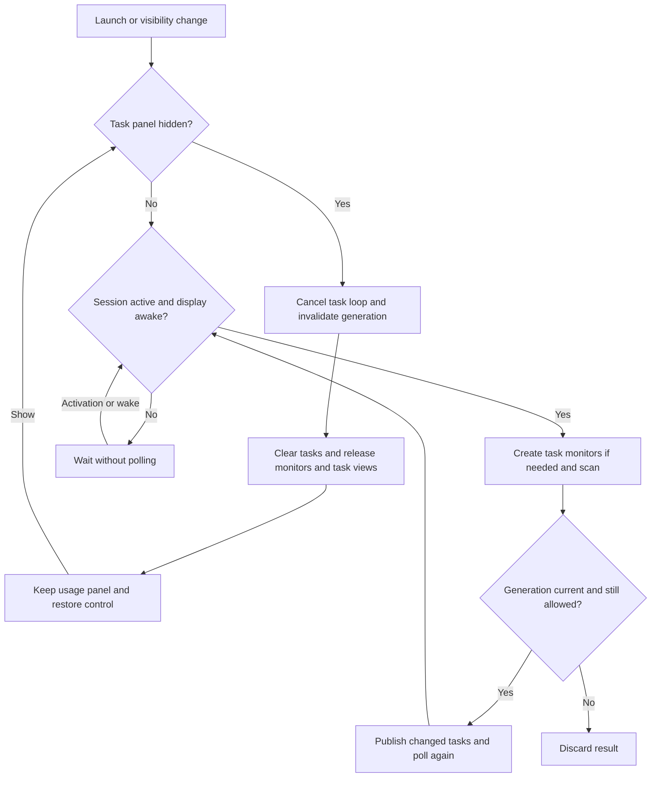

# Codex Pulse

<p align="center">
  <a href="README.md">English</a> ·
  <a href="README.zh-CN.md">简体中文</a> ·
  <a href="README.zh-HK.md">繁體中文（香港）</a> ·
  <a href="README.zh-TW.md">繁體中文（台灣）</a> ·
  <a href="README.ja.md">日本語</a> ·
  <strong>한국어</strong>
</p>

Codex Pulse는 Dock 옆에 로컬 Codex, Claude Code, OpenCode의 사용량과 작업 활동을 보여 주는 macOS 26+ 데스크톱 보조 앱입니다. SwiftUI와 AppKit으로 만들었으며, 사용량 데이터를 업로드하거나 원본 기록을 수정하지 않고 로컬 기록을 읽습니다.

<p align="center">
  <a href="https://iwecon.github.io/CodexPulse/">
    
  </a>
</p>

[제품 페이지 및 인터랙티브 데모](https://iwecon.github.io/CodexPulse/) · [릴리스 다운로드](https://github.com/iwecon/CodexPulse/releases/latest)

## 설치

macOS 26 이상에서는 Releases에서 Mac에 맞는 DMG를 다운로드합니다. Apple Silicon용은 `Codex-Pulse-arm64.dmg`, Intel용은 `Codex-Pulse-x86_64.dmg`입니다. DMG를 열고 `Codex Pulse.app`을 Applications에 복사합니다.

Homebrew가 설치되어 있다면 이 저장소의 Tap을 대신 사용할 수 있습니다.

```bash
brew tap iwecon/codex-pulse https://github.com/iwecon/CodexPulse
brew install --cask iwecon/codex-pulse/codex-pulse
```

대체 설치 프로그램을 사용하려면 Node.js 18+와 npm이 필요합니다.

```bash
npm install -g github:iwecon/CodexPulse
codex-pulse install
codex-pulse open
```

npm 명령은 어느 디렉터리에서나 실행할 수 있습니다. CLI만 설치해도 앱은 설치되지 않습니다. `codex-pulse install`은 릴리스 DMG를 다운로드하고 마운트한 뒤 앱을 `~/Applications/Codex Pulse.app`에 복사합니다. 기존 설치를 교체하려면 `--force`를 추가합니다. 지원되는 명령은 [설치 프로그램 CLI](npm/bin/codex-pulse.js)를 참조하세요.

## 패널 사용

여러 디스플레이를 연결하면 두 패널은 시스템 주 디스플레이에 고정되며 포인터나 포커스된 창을 따라 이동하지 않습니다. 주 디스플레이를 변경하거나 디스플레이를 연결·분리하면 배치가 자동으로 갱신됩니다.

앱에는 Dock 아이콘이 없습니다. 투명한 패널은 데스크톱 아이콘 위와 일반 앱 창 아래에 머물며, Dock이 아래쪽·왼쪽·오른쪽에 있을 때 그 배치를 따르고 여러 Space를 지원합니다.

| 패널 | 표시 내용 |
| --- | --- |
| **Usage Overview Panel** (`用量概览面板`) | 롤링 14일 토큰 사용 추세와 도구별 합계, 그리고 제공되는 경우 Codex 주간 쿼터를 표시합니다. 해당 기간에 사용량이 없는 도구는 자동으로 숨깁니다. |
| **Task Activity Panel** (`任务活动面板`) | 세 도구 모두의 활성 작업과 최근 작업을 프로젝트와 세션별로 묶어 상태 표시기와 최신 사용자 메시지와 함께 보여 줍니다. |

기본적으로 아래쪽 Dock에서는 사용량이 왼쪽, 작업이 오른쪽에 표시됩니다. Dock이 세로 방향이면 사용량이 작업 위에 표시됩니다. 패널을 이동해도 이 이름이 가리키는 역할은 바뀌지 않습니다.

아래쪽 Dock의 한쪽에 패널의 설정 너비를 확보할 공간이 부족하면, 해당 쪽 패널은 좌우 위치와 쌓임 순서를 유지한 채 Dock 위로 자동 이동합니다. 공간이 다시 확보되면 Dock 옆으로 돌아옵니다.

주간 한도는 기본적으로 사용량 오른쪽에 표시됩니다. 위치 버튼을 누르면 오른쪽, 위, 아래, 왼쪽 순서로 전환되며, 화면에서의 패널 위치와 별개로 저장됩니다. 위아래 배치에서는 패널 높이가 늘어납니다. 주간 한도를 숨기거나 한도 데이터가 없으면 추가 공간과 위치 버튼도 사라집니다.

패널 안에서 포인터를 0.5초 동안 멈추면 컨트롤이 나타납니다. 크기 조절 가장자리를 드래그하거나 버튼을 사용해 패널을 이동하고 쌓이는 순서를 바꿀 수 있습니다. Usage Overview Panel에는 언어 선택, 도구별 막대 색상, 주간 쿼터 표시, Photos 배경화면 권한도 있습니다. Task Activity Panel에는 텍스트 정렬과 숨기기 버튼이 있습니다. 설정은 로컬에 저장됩니다. 인터페이스는 중국 본토 간체 중국어, 홍콩·대만 번체 중국어, 일본어, 한국어, 영어를 지원하며 초기 기본값은 간체 중국어입니다.

일반 콘텐츠는 클릭을 통과합니다. Codex 세션 제목을 열면 해당 ChatGPT 대화가 열리고, Claude Code와 OpenCode 제목은 클릭을 통과합니다. 텍스트는 각 패널 아래의 배경화면에 맞춰 조정됩니다. 샘플링에는 로컬 자산만 사용하며 화면을 캡처하지 않습니다. Photos 보관함 배경화면은 기존 접근 권한을 사용하고, 컨트롤에서 명시적으로 요청할 때만 추가 권한을 요청합니다. 사용할 수 없는 배경화면 자산은 이미지를 다운로드하지 않고 시스템 외관으로 대체합니다.

로컬 쿼터 스냅샷을 제공하는 도구는 Codex뿐입니다. 최신 계정 수준 레코드를 사용해 남은 쿼터를 `100 - used_percent`로 계산합니다. 바닥글의 주간 토큰 합계는 추정치이며, 계산은 `tokens recorded in the quota window ÷ used_percent × 100`이고 원시 소비 백분율을 사용합니다. 공식 토큰 허용량이 아니며 다른 기기나 클라우드 세션의 활동이 빠질 수 있습니다. 입력이 없거나 유효하지 않으면 사용량만 표시합니다. 설명을 보려면 주간 쿼터 표시 컨트롤 위에 포인터를 올리세요.

로그 활동이 3분 동안 없는 Codex 턴은 일시 중지된 것으로 표시되고 마지막 활동 후 10분이 지나면 만료됩니다. 새 활동으로 재개되는 것은 로그 출력이 없어 추론된 일시 중지뿐입니다. 완료된 작업, 명시적으로 일시 중지된 작업, 종료된 작업은 10분 동안 남습니다. Claude Code와 OpenCode는 로컬 기록에서 턴을 추론하며 세션이 12분 넘게 비활성 상태인 실행 중 턴을 제거합니다. 따라서 오랫동안 로그 출력이 없는 도구 호출은 잠시 일시 중지로 보이거나 사라질 수 있습니다.

Debug가 아닌 `.app`은 처음 실행할 때 로그인 시 실행을 구성하고, 이후 시스템 설정에서 사용자가 비활성화한 상태를 존중합니다. Debug 빌드와 원시 실행 파일(`swift run` 포함)은 로그인 항목을 변경하지 않습니다.

## 로컬 데이터 및 새로 고침

지원되는 도구를 표준 로컬 데이터 위치에서 사용하기만 하면 API 키나 소스 설정이 필요하지 않습니다.

| 소스 | 읽는 레코드 |
| --- | --- |
| Codex 사용량 | `~/.codex/sessions/**/*.jsonl`, `~/.codex/archived_sessions/**/*.jsonl` |
| Codex 작업 인덱스 | `~/.codex/state_*.sqlite` 및 이 파일이 참조하는 세션 로그 |
| Claude Code 사용량 및 작업 | `~/.claude/projects/**/*.jsonl` |
| OpenCode 사용량 및 작업 | `~/.local/share/opencode/opencode.db` 및 WAL/SHM 변경 감지 |

소스가 없거나 읽을 수 없으면 해당 도구만 영향을 받습니다. 사용량 집계는 보이는 14일 범위를 대상으로 하며 파생 데이터는 메모리에만 보관합니다. 콜드 스캔에서는 관련 파일과 행을 필터링하고, 이후 스캔에서는 메모리 상태를 재사용해 추가되거나 변경된 부분만 처리합니다. JSONL은 청크 단위로 읽으며 파생 사용량 데이터베이스나 디스크 캐시를 만들지 않습니다. 세션이 비활성 상태이거나 디스플레이가 잠들어 있는 동안에는 사용량 및 작업 새로 고침과 작업 상태 애니메이션을 모두 일시 중지하고, 두 조건이 모두 해제되면 재개합니다.

### 작업 활동 숨기기 및 복원

컨트롤에서 **작업 활동 패널 숨기기**를 선택한 다음, 복원하려면 Usage Overview Panel에서 **작업 활동 패널 표시**를 선택합니다. 숨김 상태는 실행 사이에도 유지되고 작업 모니터링을 취소하며 작업을 지웁니다. 취소된 읽기가 끝나면 작업 전용 캐시를 해제합니다. 또한 작업 뷰, 링크, 컨트롤, 배경화면 샘플링 영역을 제거합니다. 사용량 스캔은 독립적으로 계속되며 같은 로그를 읽을 수 있습니다. 복원해도 패널 설정은 유지되고 현재 레코드를 스캔합니다. 숨겨진 시간도 만료에 포함됩니다.



[UsageModel.swift](Sources/CodexPulse/UsageModel.swift)은 새로 고침 가능 여부와 세대를 관리하고, [TaskMonitoringSession.swift](Sources/CodexPulse/TaskMonitoringSession.swift)은 세 가지 작업 모니터를 관리합니다. 숨김 상태로 실행하면 작업 모니터링을 시작하지 않습니다. 객체를 해제해도 회수 가능한 할당자 페이지가 프로세스 풋프린트에서 즉시 사라진다는 보장은 없습니다.

## 개발 및 검증

macOS 26+, 선택된 Swift 6.2+ 툴체인이 있는 Xcode 26+, 시스템 SQLite 3 라이브러리를 사용하세요. [Swift 패키지](Package.swift)에는 외부 패키지 의존성이 없습니다. 저장소 루트에서 다음 명령을 실행합니다.

```bash
swift build
swift run "Codex Pulse"
swift test
```

Debug `.app`의 경우 저장소 루트에서 `./script/build_and_run.sh`를 사용합니다. 기존 `Codex Pulse` 프로세스를 중지하고 `dist/Codex Pulse Debug.app`을 다시 빌드한 뒤 실행합니다. 이 스크립트는 `--debug`, `--logs`, `--telemetry`, `--verify`도 지원합니다. 자세한 내용은 [스크립트](script/build_and_run.sh)를 참조하세요.

[테스트 스위트](Tests/CodexPulseTests)는 파서, 증분 스캔, 쿼터 계산, 작업 수명 주기, 패널 기하 구조, 배경화면 동작, 현지화, 로그인 시 실행 자격을 다룹니다. [AGENTS.md](AGENTS.md)에는 프로젝트별 제약과 전체 스위트 또는 UI·메모리 검사가 필요한 변경 사항이 기록되어 있습니다.

로컬 세션을 대상으로 선택적으로 읽기 전용 작업 메모리 검사를 하려면 저장소 루트에서 다음을 실행합니다.

```bash
CODEXPULSE_LOCAL_TASK_MEMORY=1 swift test --filter TaskMonitoringMemoryTests
```

일반 스위트에서는 이 프로브를 건너뜁니다. 세 번의 표시 전환 주기 동안 모니터 해제와 숨김 상태의 폴링을 확인하고, 객체 수명과 별개로 물리적 풋프린트를 보고합니다.

## 코드 탐색

| 영역 | 진입점 |
| --- | --- |
| 앱 및 패널 컨트롤 | [App.swift](Sources/CodexPulse/App.swift), [DockPanelResizing.swift](Sources/CodexPulse/DockPanelResizing.swift), [CodexSessionLink.swift](Sources/CodexPulse/CodexSessionLink.swift) |
| 사용량 집계 및 모델 | [UsageScanner.swift](Sources/CodexPulse/UsageScanner.swift), [Models.swift](Sources/CodexPulse/Models.swift) |
| 새로 고침 및 작업 수명 주기 | [UsageModel.swift](Sources/CodexPulse/UsageModel.swift), [TaskMonitoringSession.swift](Sources/CodexPulse/TaskMonitoringSession.swift), [RefreshActivityGate.swift](Sources/CodexPulse/RefreshActivityGate.swift) |
| 배경화면 외관 | [WallpaperAppearance.swift](Sources/CodexPulse/WallpaperAppearance.swift), [WallpaperSourceResolver.swift](Sources/CodexPulse/WallpaperSourceResolver.swift), [AdaptiveTextColor.swift](Sources/CodexPulse/AdaptiveTextColor.swift) |
| 환경 설정 및 시작 | [AppLanguage.swift](Sources/CodexPulse/AppLanguage.swift), [ToolBarColorSettings.swift](Sources/CodexPulse/ToolBarColorSettings.swift), [LaunchAtLoginManager.swift](Sources/CodexPulse/LaunchAtLoginManager.swift) |
| 제품 사이트 및 배포 | [docs/index.html](docs/index.html), [Homebrew cask](Casks/codex-pulse.rb), [npm package](package.json), [release workflow](.github/workflows/release.yml) |

## 패키징 및 릴리스

로컬 패키징은 위의 개발 전제 조건을 갖춘 뒤 저장소 루트에서 수행합니다. `arm64` 또는 `x86_64`를 선택하고 `X.Y.Z`를 숫자 버전으로 바꿉니다.

```bash
./script/package_release.sh --arch arm64 --version X.Y.Z --output dist
```

이 명령은 릴리스 앱을 빌드하고 `dist/Codex-Pulse-arm64.dmg`를 작성하며 공개하지는 않습니다. 로컬 패키징은 기본적으로 임시 서명을 사용합니다. [패키징 스크립트](script/package_release.sh)는 Developer ID 서명을 위한 `--signing-identity`와 선택 사항인 `--signing-keychain`을 받고, 외부 SQLite 라이브러리를 포함한 시스템 외 동적 의존성을 거부합니다.

`vX.Y.Z` 태그를 푸시하거나 [릴리스 워크플로](.github/workflows/release.yml)를 수동으로 디스패치하면 두 아키텍처를 빌드하고 DMG와 `SHA256SUMS`가 포함된 공개 GitHub Release를 만들거나 갱신합니다. CI에서 서명, 공증, 티켓 스테이플링을 수행하려면 Developer ID Application 인증서/개인 키와 App Store Connect API 키가 필요합니다. 정확한 저장소 시크릿 이름과 검증 단계는 해당 워크플로에 정의되어 있습니다. 선별된 릴리스 노트는 있으면 `.github/release-notes/vX.Y.Z.md`에서 가져옵니다. 선택적 npm 게시 여부는 `PUBLISH_NPM=true`와 `NPM_TOKEN`으로 제어합니다. 이러한 작업은 아티팩트를 게시하며 릴리스 자격 증명이 필요합니다. 위 명령은 로컬 개발과 패키징만 다룹니다.
