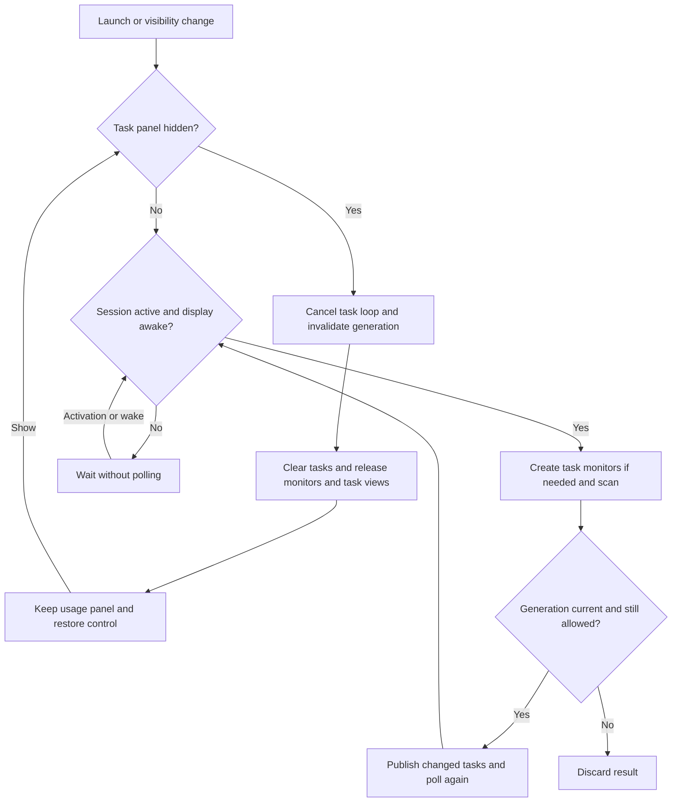

# Codex Pulse

<p align="center">
  <strong>English</strong> ·
  <a href="README.zh-CN.md">简体中文</a> ·
  <a href="README.zh-HK.md">繁體中文（香港）</a> ·
  <a href="README.zh-TW.md">繁體中文（台灣）</a> ·
  <a href="README.ja.md">日本語</a> ·
  <a href="README.ko.md">한국어</a>
</p>

Codex Pulse is a macOS 26+ desktop accessory that shows local Codex, Claude Code, and OpenCode usage and task activity beside the Dock. Built with SwiftUI and AppKit, it reads local records without uploading usage data or modifying the originals.

<p align="center">
  <a href="https://iwecon.github.io/CodexPulse/">
    
  </a>
</p>

[Product page and interactive demo](https://iwecon.github.io/CodexPulse/) · [Download releases](https://github.com/iwecon/CodexPulse/releases/latest)

## Install

On macOS 26 or later, download the DMG for your Mac from Releases: `Codex-Pulse-arm64.dmg` for Apple silicon or `Codex-Pulse-x86_64.dmg` for Intel. Open it and copy `Codex Pulse.app` to Applications.

With Homebrew installed, you can instead use this repository's tap:

```bash
brew tap iwecon/codex-pulse https://github.com/iwecon/CodexPulse
brew install --cask iwecon/codex-pulse/codex-pulse
```

An alternative installer requires Node.js 18+ and npm:

```bash
npm install -g github:iwecon/CodexPulse
codex-pulse install
codex-pulse open
```

The npm commands work from any directory. Installing the CLI alone does not install the app; `codex-pulse install` downloads and mounts the release DMG and copies the app to `~/Applications/Codex Pulse.app`. Add `--force` to replace an existing installation. See the [installer CLI](npm/bin/codex-pulse.js) for its supported commands.

## Use the panels

The app has no Dock icon. Its transparent panels stay above desktop icons and below ordinary app windows, follow bottom, left, or right Dock placement, and support multiple Spaces.

| Panel | What it shows |
| --- | --- |
| **Usage Overview Panel** (`用量概览面板`) | A rolling 14-day token trend and per-tool totals, plus the Codex weekly quota when available. Tools with no usage in that window are hidden automatically. |
| **Task Activity Panel** (`任务活动面板`) | Active and recent tasks from all three tools, grouped by project and session, with status indicators and the latest user message. |

By default, usage appears on the left and tasks on the right of a bottom Dock; with a vertical Dock, usage appears above tasks. These names describe responsibilities even after you move the panels.

Hold the pointer still inside a panel for half a second to reveal its controls. Drag the resize edge or use the buttons to move panels and change their stacking order. The Usage Overview Panel also offers language selection, per-tool bar colors, weekly-quota visibility, and Photos wallpaper permission. The Task Activity Panel offers text alignment and a hide button. Preferences persist locally. The interface supports Simplified Chinese, Hong Kong and Taiwan Traditional Chinese, Japanese, Korean, and English; Simplified Chinese is the initial default.

Ordinary content is click-through. Codex session titles open the corresponding conversation in ChatGPT; Claude Code and OpenCode titles remain click-through. Text adapts to the wallpaper beneath each panel. Sampling uses local assets, never screen capture; Photos-library wallpapers use existing access unless you explicitly request permission through the control. Unavailable wallpaper assets fall back to system appearance without downloading images.

Only Codex provides local quota snapshots. Remaining quota is `100 - used_percent`, using the newest account-level record. The footer's weekly token total is an estimate: `tokens recorded in the quota window ÷ used_percent × 100`, using the raw consumed percentage. It is not an official token allowance and may omit activity from other devices or cloud sessions; missing or invalid inputs keep the used-only display. Hover the weekly-quota visibility control for the explanation.

A Codex turn with no log activity for 3 minutes appears paused and expires 10 minutes after its last activity; new activity resumes only a silence-inferred pause. Completed, explicitly paused, and terminated tasks remain for 10 minutes. Claude Code and OpenCode infer turns from local records and drop running turns after more than 12 minutes of session inactivity. A long silent tool call can therefore temporarily look paused or disappear.

A non-Debug `.app` configures launch at login on first launch and respects later disabling in System Settings. Debug builds and raw executables, including `swift run`, leave login items untouched.

## Local data and refresh

No API key or source setup is needed beyond using the supported tools locally with their standard data locations:

| Source | Records read |
| --- | --- |
| Codex usage | `~/.codex/sessions/**/*.jsonl`, `~/.codex/archived_sessions/**/*.jsonl` |
| Codex task index | `~/.codex/state_*.sqlite` and the session logs it references |
| Claude Code usage and tasks | `~/.claude/projects/**/*.jsonl` |
| OpenCode usage and tasks | `~/.local/share/opencode/opencode.db`, including WAL/SHM change detection |

Missing or unreadable sources affect only the corresponding tool. Usage aggregation covers the visible 14-day window and keeps derived data in memory only. Cold scans filter relevant files and rows; subsequent scans reuse in-memory state and process additions or changes. JSONL reading is chunked, and no derived usage database or disk cache is created. Both usage and task refresh, along with task-status animation, pause while the session is inactive or displays are asleep; they resume when both conditions clear.

### Hide and restore task activity

Choose **Hide Task Activity Panel** in its controls, then **Show Task Activity Panel** in the Usage Overview Panel to restore it. Hiding persists across launches, cancels task monitoring, clears tasks, and releases task-only caches after cancelled reads exit. It also removes task views, links, controls, and wallpaper sampling regions. Usage scanning stays independent and may still read the same logs. Restoring keeps panel preferences and scans current records; hidden time counts toward expiry.



[UsageModel.swift](Sources/CodexPulse/UsageModel.swift) owns refresh eligibility and generations; [TaskMonitoringSession.swift](Sources/CodexPulse/TaskMonitoringSession.swift) owns the three task monitors. A hidden launch never starts task monitoring. Object release does not guarantee that reclaimable allocator pages immediately disappear from the process footprint.

## Develop and verify

Use macOS 26+, Xcode 26+ with a selected Swift 6.2+ toolchain, and the system SQLite 3 library. The [Swift package](Package.swift) has no external package dependencies. Run these commands from the repository root:

```bash
swift build
swift run "Codex Pulse"
swift test
```

For a Debug `.app`, use `./script/build_and_run.sh` from the repository root. It stops an existing `Codex Pulse` process, rebuilds `dist/Codex Pulse Debug.app`, and launches it. The script also supports `--debug`, `--logs`, `--telemetry`, and `--verify`; see [the script](script/build_and_run.sh) for details.

The [test suite](Tests/CodexPulseTests) covers parsers, incremental scans, quota calculations, task lifecycle, panel geometry, wallpaper behavior, localization, and login eligibility. [AGENTS.md](AGENTS.md) records project-specific constraints and the changes that require the full suite or UI and memory checks.

For an opt-in, read-only task-memory check against your local sessions, run this from the repository root:

```bash
CODEXPULSE_LOCAL_TASK_MEMORY=1 swift test --filter TaskMonitoringMemoryTests
```

The ordinary suite skips this probe. It checks monitor release and hidden polling over three visibility cycles and reports physical footprint separately from object lifetime.

## Code navigation

| Area | Entry points |
| --- | --- |
| App and panel controls | [App.swift](Sources/CodexPulse/App.swift), [DockPanelResizing.swift](Sources/CodexPulse/DockPanelResizing.swift), [CodexSessionLink.swift](Sources/CodexPulse/CodexSessionLink.swift) |
| Usage aggregation and models | [UsageScanner.swift](Sources/CodexPulse/UsageScanner.swift), [Models.swift](Sources/CodexPulse/Models.swift) |
| Refresh and task lifecycle | [UsageModel.swift](Sources/CodexPulse/UsageModel.swift), [TaskMonitoringSession.swift](Sources/CodexPulse/TaskMonitoringSession.swift), [RefreshActivityGate.swift](Sources/CodexPulse/RefreshActivityGate.swift) |
| Wallpaper appearance | [WallpaperAppearance.swift](Sources/CodexPulse/WallpaperAppearance.swift), [WallpaperSourceResolver.swift](Sources/CodexPulse/WallpaperSourceResolver.swift), [AdaptiveTextColor.swift](Sources/CodexPulse/AdaptiveTextColor.swift) |
| Preferences and startup | [AppLanguage.swift](Sources/CodexPulse/AppLanguage.swift), [ToolBarColorSettings.swift](Sources/CodexPulse/ToolBarColorSettings.swift), [LaunchAtLoginManager.swift](Sources/CodexPulse/LaunchAtLoginManager.swift) |
| Product site and distribution | [docs/index.html](docs/index.html), [Homebrew cask](Casks/codex-pulse.rb), [npm package](package.json), [release workflow](.github/workflows/release.yml) |

## Package and release

For local packaging, run this from the repository root with the development prerequisites above, choosing `arm64` or `x86_64` and replacing `X.Y.Z` with a numeric version:

```bash
./script/package_release.sh --arch arm64 --version X.Y.Z --output dist
```

This builds a release app and writes `dist/Codex-Pulse-arm64.dmg`; it does not publish it. Local packaging defaults to ad hoc signing. The [packaging script](script/package_release.sh) accepts `--signing-identity` and optional `--signing-keychain` for Developer ID signing and rejects non-system dynamic dependencies, including external SQLite libraries.

Pushing a `vX.Y.Z` tag or manually dispatching the [release workflow](.github/workflows/release.yml) builds both architectures and creates or updates a public GitHub Release with DMGs and `SHA256SUMS`. CI requires a Developer ID Application certificate/private key and an App Store Connect API key for signing, notarization, and stapling; the exact repository secret names and validation steps are defined in that workflow. Curated notes come from `.github/release-notes/vX.Y.Z.md` when present. Optional npm publication is controlled by `PUBLISH_NPM=true` and `NPM_TOKEN`. These operations publish artifacts and require release credentials; the commands above only cover local development and packaging.
