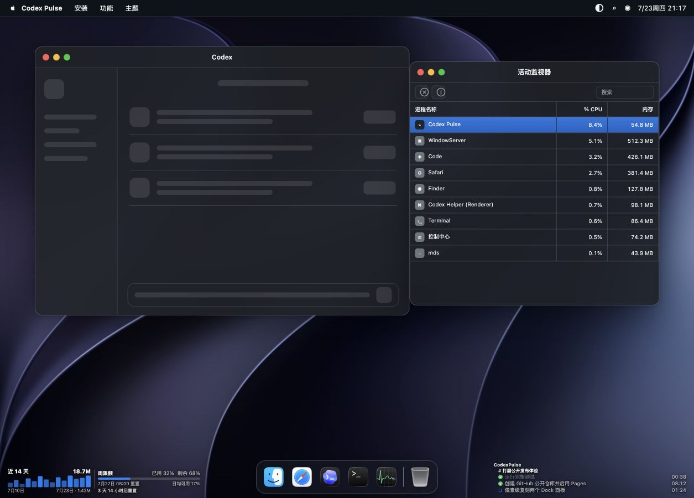

# Codex Pulse

<p align="center">
  <a href="README.md">English</a> ·
  <strong>简体中文</strong> ·
  <a href="README.zh-HK.md">繁體中文（香港）</a> ·
  <a href="README.zh-TW.md">繁體中文（台灣）</a> ·
  <a href="README.ja.md">日本語</a> ·
  <a href="README.ko.md">한국어</a>
</p>

Codex Pulse 是一个使用 SwiftUI 与 AppKit 构建的 macOS 桌面配件，通过 Dock 两侧的**用量概览面板**和**任务活动面板**展示本机 Codex Token 用量、周额度和最近任务状态。所有数据均从本机读取，不上传。

<p align="center">
  <a href="https://iwecon.github.io/CodexPulse/">
    
  </a>
</p>

<p align="center">
  <a href="https://iwecon.github.io/CodexPulse/">产品落地页</a>
  ·
  <a href="https://github.com/iwecon/CodexPulse/releases/latest">下载最新版</a>
  ·
  <a href="https://github.com/iwecon/CodexPulse">查看源码</a>
</p>

产品落地页在桌面浏览器中提供可交互的 macOS 桌面演示，包括主题菜单、可拖动窗口、Activity Monitor 动态指标、与应用一致的 Dock 面板操作控件，以及适配明暗主题的真实系统应用图标；760px 及以下继续使用移动端纵向页面。

## 安装

需要 macOS 26 或更高版本。GitHub Actions 会为 Apple 芯片（arm64）和 Intel 芯片（x86_64）分别构建 DMG，并随版本发布到 [GitHub Releases](https://github.com/iwecon/CodexPulse/releases/latest)。

### AI 辅助安装

将以下提示词原样交给你的编程助手：

```text
From https://iwecon.github.io/CodexPulse/ to Install CodexPulse. Try Homebrew first, then npm, and finally download and install via the GitHub Release Page.
```

### Homebrew

当前仓库同时作为自定义 Tap 使用：

```bash
brew tap iwecon/codex-pulse https://github.com/iwecon/CodexPulse
brew install --cask iwecon/codex-pulse/codex-pulse
```

### npm

npm 包提供一个显式安装 CLI，不会在 `npm install` 阶段静默挂载 DMG 或修改应用目录：

```bash
npm install -g github:iwecon/CodexPulse
codex-pulse install
```

应用默认安装到 `~/Applications/Codex Pulse.app`。再次安装时可使用 `codex-pulse install --force`，安装后可运行 `codex-pulse open`。

仓库配置 npm 发布凭据后，也可以使用注册表短命令 `npm install -g @iwecon/codex-pulse`。

### 签名说明

当前公开构建使用临时签名，尚未使用 Apple Developer ID 签名与公证。首次打开下载版时，macOS 可能显示来源确认提示。配置 Developer ID 与公证凭据后，可在发布工作流中升级为完整的签名和公证流程。

## 面板术语

- **用量概览面板（Usage Overview Panel）**：Dock 位于屏幕底部时显示在左侧，汇总最近 14 天的 Token 用量趋势和 Codex 周额度。
- **任务活动面板（Task Activity Panel）**：Dock 位于屏幕底部时显示在右侧，按项目和会话展示正在执行及最近完成的 Codex 任务。

这两个名称按面板职责定义，是文档、需求和代码讨论中的正式术语。Dock 位于屏幕左侧或右侧时，用量概览面板会移至上方，任务活动面板会移至下方，但名称不随位置改变。

## 功能

- 当前只统计 Codex 的 Token 用量。Claude Code 和 OpenCode 的扫描实现保留，但默认关闭，后续可通过 `UsageSourcePolicy.enabledTools` 重新启用。
- 展示最近 14 天的用量趋势，并在今日日期旁显示今日 Token 消耗。
- 展示 Codex 周额度、剩余比例、重置时间、按剩余时长分级的倒计时（最后一分钟显示秒），以及按精确剩余时间折算的日均可用百分比。
- 任务活动面板会按当前可见内容动态调整高度，通常最高 120px；从底部开始按项目和会话展示所有执行中及最近 10 分钟完成的 Codex 任务。执行中的任务不受 10 分钟限制且必须全部显示，必要时面板会超过 120px；剩余空间再按完成时间由新到旧容纳已完成任务。执行中的任务使用带渐变拖尾的旋转圆环指示状态；新增和移除任务时会使用短暂过渡动画，并遵循系统“减少动态效果”设置；完成超过 3 分钟的任务消息会降低对比度，完成超过 10 分钟后从列表移除；最新用户消息按实际一至两行紧凑显示。
- 自动跟随 Dock 位于底部、左侧或右侧时调整面板位置。
- 两个主面板的内容文字、会话标题与项目标题统一使用白字和轻微黑色阴影，不再根据墙纸明暗切换为黑字或绘制多层反色描边；主文字与次要文字仍保留不同亮度层级。面板保持完全透明，不截取屏幕，也不需要“屏幕录制”权限。
- 两个主面板仍会分别采样各自下方的桌面墙纸区域，为其他语义外观元素选择合适的明暗状态。系统在深色与浅色外观之间切换时会先立即同步面板语义外观，待墙纸完成切换后清除缓存并恢复两个面板各自的区域采样；切换空间、唤醒屏幕或恢复登录会检查墙纸文件与显示选项，仅在状态变化时重新采样，避免长期停留在系统外观兜底状态或进行无效解码。
- 面板显示在桌面图标之上、普通应用窗口之下，不会覆盖当前活动应用。
- 指针在任一面板内连续静止停留 0.5 秒后，会在面板内侧缩放边缘显示一个覆盖主面板内容宽度的统一 Liquid Glass 横向控制组；停留期间移动指针会重新计时。两个面板使用相同的淡入动画。所有玻璃表面使用连续圆角；34px 宽度拖动段位于内容内侧：左侧面板的拖动段右边缘与内容右边缘对齐，右侧面板的拖动段左边缘与内容左边缘对齐，并和操作按钮一样响应 6px 外层内边距。旁边的面板操作按钮均分并填满其余操作区域。左侧面板固定左边缘、从右边缘缩放，右侧面板固定右边缘、从左边缘缩放；底部 Dock 较高时交互区会向上延伸，保持足够大的可操作区域。指针离开主面板和当前控制组的联合范围后，控制组会等待 1 秒再淡出，期间返回或正在拖动都保持显示。
- 指针进入 34px 缩放段时，其他操作按钮会在 0.34 秒内缩放至 0.98 并淡出；外层 Liquid Glass 背景保持完整宽度，仅向内收缩原有的 6px 内边距、把圆角过渡为 10px，并淡出至完全透明。动画结束后交互窗口才收缩到缩放段本身，避免透明区域拦截点击。离开缩放段不会恢复背景和操作按钮，只有指针进入任一操作按钮的实际范围才反向恢复完整控制组；拖动过程中则始终只保留缩放段直到松开指针。
- 控制组中的左右移动按钮始终存在，可把当前面板切换到另一逻辑侧；切换后按钮会反向显示，随时可移回。两个面板同侧时，控制组另行显示上下交换按钮，用于切换堆叠顺序。底部 Dock 的逻辑侧对应左右，垂直 Dock 对应上方和下方；调整后的位置和两个面板各自的宽度会持久化，并在下次启动时自动恢复，同时根据当前屏幕、Dock 和可用空间自动夹取，避免面板互相覆盖。用量概览面板位于逻辑右侧时，其趋势与周额度布局会同步镜像并靠右对齐。
- 任务活动面板的控制组提供文字对齐按钮，点击会在自动、左对齐和右对齐之间循环并切换图标，选择会持久化。默认使用自动对齐：面板位于左侧时左对齐，位于右侧时右对齐；右对齐时项目、会话和任务消息靠右排列，持续时间移到状态图标之前。
- 用量概览面板的控制组提供语言切换按钮；点击后，操作区域会替换为原生 AppKit 纵向滚轮选择器。可点击可见语言项、按住后上下拖动，或通过鼠标滚轮和触控板即时切换。支持中国大陆简体中文、香港繁体中文、台湾繁体中文、日语、韩语和英语；选择会应用到两个面板的界面文字、日期格式及 AppKit 控件的辅助功能标签和工具提示，并仅保存在本机 `UserDefaults` 中。首次启动默认使用中国大陆简体中文。
- 用量概览面板和任务活动面板的普通内容保持点击穿透且不激活应用；任务活动面板中的会话标题可点击并在 ChatGPT 中打开对应 Codex 会话，独立显示的统一 Liquid Glass 控制组仍可接收指针输入。
- 非 Debug 的 `.app` 首次启动时自动配置登录启动。

Codex 额度以会话日志中时间最新的 `rate_limits` 快照为准，避免旧会话覆盖当前额度。只有日志实际包含该字段时才会显示额度。

## 资源占用

- 首次启动需要读取现有历史数据；JSONL 使用固定大小分块逐行解析，不会把整个日志文件同时展开为 `Data` 和 `String`。
- Codex 解析结果按文件缓存，后续刷新只重新解析新增或发生变化的文件。当前关闭的 Claude Code 和 OpenCode 也保留各自的文件缓存及数据库/WAL/SHM 缓存实现，重新启用后继续遵循增量扫描规则。
- Codex 任务日志按字节游标增量读取；任务索引查询会短期缓存，避免每次轮询都重新查询 SQLite。
- 用户会话锁定或显示器休眠时暂停用量与任务数据刷新，并冻结执行中任务的状态动画；解锁且显示器重新唤醒后立即恢复。
- 数据内容未变化时不会重复发布 SwiftUI 状态。倒计时、任务时长和运行指示器只刷新各自的小型子视图，避免整个面板高频重绘。

冷启动仍可能因本机历史数据量较大而出现短暂内存峰值；完成首次扫描后应回落到稳定态。后续周期刷新不应再次全量扫描所有历史文件。

## 环境要求

- macOS 26+
- Xcode 26+ / Swift 6.2+
- SQLite 3

## 运行

```bash
swift run "Codex Pulse"
```

应用以 accessory 模式运行，不显示 Dock 图标。`swift run`、其他原始可执行文件以及 Debug 构建均不会读取、写入或配置登录启动项。只有非 Debug 的 `.app` 会使用 macOS `SMAppService` 配置系统登录项。

如果用户在系统设置中关闭登录项，应用不会在之后的普通启动中强制重新启用它。

## 发布

推送形如 `v0.1.0` 的标签会触发 `.github/workflows/release.yml`，分别在 GitHub 的 macOS 26 arm64 与 Intel 托管运行器上构建：

- `Codex-Pulse-arm64.dmg`
- `Codex-Pulse-x86_64.dmg`
- `SHA256SUMS`

工作流随后创建或更新对应的 GitHub Release。若仓库变量 `PUBLISH_NPM=true` 且已配置 npm 发布凭据 `NPM_TOKEN`，同一版本也会发布为 `@iwecon/codex-pulse`。

## 测试

```bash
swift test
```

测试覆盖日志解析、日期处理、Codex 最新额度选择、任务状态、紧凑数字格式、登录启动资格、Dock 面板布局与控制组几何、窗口层级、墙纸坐标映射与外观选择、墙纸缓存失效，以及锁屏与休眠时的刷新状态切换。

## 数据来源

- Codex 用量（已启用）：`~/.codex/sessions/**/*.jsonl`
- Codex 任务索引：`~/.codex/state_*.sqlite`
- Claude Code（已关闭，入口保留）：`~/.claude/projects/**/*.jsonl`
- OpenCode（已关闭，入口保留）：`~/.local/share/opencode/opencode.db`

启用的数据源读取失败或不存在时只影响对应工具，不会上传数据或修改原始会话记录。关闭的数据源不会访问其本地文件。
