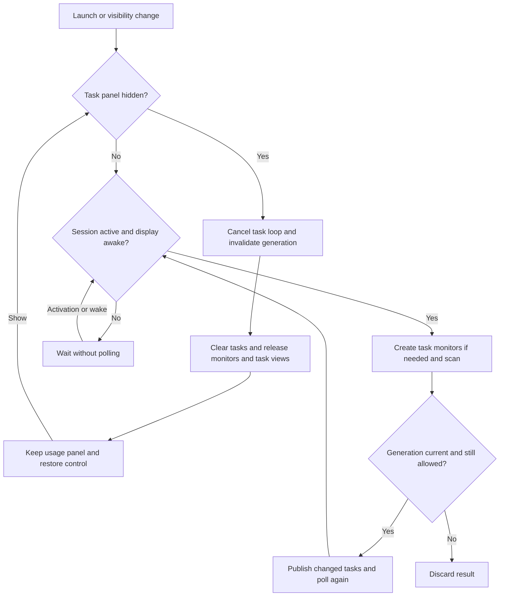

# Codex Pulse

<p align="center">
  <a href="README.md">English</a> ·
  <strong>简体中文</strong> ·
  <a href="README.zh-HK.md">繁體中文（香港）</a> ·
  <a href="README.zh-TW.md">繁體中文（台灣）</a> ·
  <a href="README.ja.md">日本語</a> ·
  <a href="README.ko.md">한국어</a>
</p>

Codex Pulse 是一款 macOS 26+ 桌面辅助应用，在 Dock 旁显示本机 Codex、Claude Code 和 OpenCode 的用量与任务活动。它使用 SwiftUI 和 AppKit 构建，读取本地记录，不上传用量数据，也不修改原始记录。

<p align="center">
  <a href="https://iwecon.github.io/CodexPulse/">
    
  </a>
</p>

[产品页面与交互式演示](https://iwecon.github.io/CodexPulse/) · [下载发行版](https://github.com/iwecon/CodexPulse/releases/latest)

## 安装

在 macOS 26 或更高版本上，从 Releases 下载适用于你的 Mac 的 DMG：Apple 芯片使用 `Codex-Pulse-arm64.dmg`，Intel 使用 `Codex-Pulse-x86_64.dmg`。打开后将 `Codex Pulse.app` 复制到“应用程序”文件夹。

安装 Homebrew 后，也可以使用此仓库的 tap：

```bash
brew tap iwecon/codex-pulse https://github.com/iwecon/CodexPulse
brew install --cask iwecon/codex-pulse/codex-pulse
```

另一个安装方式需要 Node.js 18+ 和 npm：

```bash
npm install -g github:iwecon/CodexPulse
codex-pulse install
codex-pulse open
```

npm 命令可从任意目录运行。单独安装 CLI 不会安装应用；`codex-pulse install` 会下载并挂载发行版 DMG，再将应用复制到 `~/Applications/Codex Pulse.app`。添加 `--force` 可替换现有安装。支持的命令请参阅[安装程序 CLI](npm/bin/codex-pulse.js)。

## 使用面板

连接多个显示器时，两个面板固定在系统主显示器，不会跟随鼠标或获得焦点的窗口切换屏幕。更改主显示器或连接、断开显示器后，面板会自动重新定位。

应用不显示 Dock 图标。透明面板位于桌面图标之上、普通应用窗口之下，会跟随 Dock 位于底部、左侧或右侧的布局，并支持多个 Space。

| 面板 | 显示内容 |
| --- | --- |
| **用量概览面板**（Usage Overview Panel） | 最近 14 天的 token 趋势和各工具总量，以及可用时的 Codex 周额度。这段时间内没有用量的工具会自动隐藏。 |
| **任务活动面板**（Task Activity Panel） | 三种工具的当前及最近任务，按项目和会话分组，并显示状态指示和最新用户消息。 |

默认情况下，底部 Dock 的左侧显示用量，右侧显示任务；Dock 垂直放置时，用量显示在任务上方。即使你移动面板，这些名称仍表示各自的职责。

将指针在面板内保持静止半秒即可显示控制项。拖动调整大小的边缘或使用按钮，可以移动面板并更改其堆叠顺序。用量概览面板还提供语言选择、各工具用量条颜色、周额度显示以及照片墙纸权限；任务活动面板提供文字对齐和隐藏按钮。偏好设置会保存在本机。界面支持简体中文、香港繁体中文、台湾繁体中文、日语、韩语和英语；首次启动默认使用简体中文。

普通内容支持点击穿透。Codex 会话标题会打开 ChatGPT 中对应的会话；Claude Code 和 OpenCode 标题保持点击穿透。文字会根据各面板下方的墙纸自适应。采样使用本地资源，从不截取屏幕；照片图库墙纸会使用已有访问权限，只有你通过控制项明确请求时才会请求权限。无法使用的墙纸资源会回退到系统外观，不会下载图片。

只有 Codex 提供本地额度快照。剩余额度为 `100 - used_percent`，使用最新的帐户级记录。底行的周 token 总量是估算值：`本周期记录的 token 数 ÷ used_percent × 100`，使用原始已用百分比计算。它不是官方 token 配额，且可能遗漏其他设备或云端会话的活动；输入缺失或无效时保留仅显示已用量的方式。将鼠标悬停在周额度显示/隐藏控件上可查看说明。

Codex 回合在 3 分钟没有日志活动后会显示为暂停，并在最后一次活动后 10 分钟过期；只有被推断为静默造成的暂停才会因新活动恢复。已完成、明确暂停和已终止的任务会保留 10 分钟。Claude Code 和 OpenCode 从本地记录推断回合，并在会话超过 12 分钟没有活动后移除仍在运行的回合。因此，长时间无输出的工具调用可能暂时显示为暂停或消失。

非 Debug 的 `.app` 会在首次启动时配置登录启动，并遵守你之后在系统设置中的禁用操作。Debug 构建和原始可执行文件（包括 `swift run`）不会改动登录项。

## 本地数据与刷新

除了在本机按标准位置使用受支持的工具外，无需 API 密钥或其他数据源设置：

| 数据源 | 读取的记录 |
| --- | --- |
| Codex 用量 | `~/.codex/sessions/**/*.jsonl`、`~/.codex/archived_sessions/**/*.jsonl` |
| Codex 任务索引 | `~/.codex/state_*.sqlite` 及其引用的会话日志 |
| Claude Code 用量和任务 | `~/.claude/projects/**/*.jsonl` |
| OpenCode 用量和任务 | `~/.local/share/opencode/opencode.db`，包括 WAL/SHM 变更检测 |

缺失或无法读取的数据源只会影响对应工具。用量汇总覆盖可见的 14 天窗口，衍生数据只保存在内存中。冷启动扫描会筛选相关文件和记录；后续扫描复用内存状态并处理新增或变更内容。JSONL 读取采用分块方式，不会创建衍生用量数据库或磁盘缓存。会话未处于活动状态或显示器进入睡眠时，用量和任务刷新以及任务状态动画都会暂停；两项条件都恢复后才会继续。

### 隐藏和恢复任务活动

在任务活动面板的控制项中选择 **隐藏任务活动面板**，然后在用量概览面板中选择 **显示任务活动面板** 即可恢复。隐藏状态会跨启动保留，会取消任务监测、清空任务，并在取消的读取退出后释放仅供任务使用的缓存。同时会移除任务视图、链接、控制项和墙纸采样区域。用量扫描保持独立，仍可能读取相同日志。恢复时会保留面板偏好设置并扫描当前记录；隐藏期间的时间仍会计入过期时间。


```mermaid
flowchart TD
    A[Launch or visibility change] --> B{Task panel hidden?}
    B -->|Yes| C[Cancel task loop and invalidate generation]
    C --> D[Clear tasks and release monitors and task views]
    D --> E[Keep usage panel and restore control]
    E -->|Show| B
    B -->|No| F{Session active and display awake?}
    F -->|No| G[Wait without polling]
    G -->|Activation or wake| F
    F -->|Yes| H[Create task monitors if needed and scan]
    H --> I{Generation current and still allowed?}
    I -->|Yes| J[Publish changed tasks and poll again]
    J --> F
    I -->|No| K[Discard result]
```

[UsageModel.swift](Sources/CodexPulse/UsageModel.swift) 负责刷新条件和扫描结果有效性；[TaskMonitoringSession.swift](Sources/CodexPulse/TaskMonitoringSession.swift) 负责三个任务监视器。隐藏启动时不会启动任务监测。对象释放并不保证可回收的分配器页面会立即从进程占用中消失。

## 开发与验证

使用 macOS 26+、Xcode 26+ 以及已选定的 Swift 6.2+ 工具链，并使用系统提供的 SQLite 3 库。[Swift package](Package.swift) 没有外部包依赖。请从仓库根目录运行以下命令：

```bash
swift build
swift run "Codex Pulse"
swift test
```

对于 Debug `.app`，请从仓库根目录使用 `./script/build_and_run.sh`。它会停止现有的 `Codex Pulse` 进程，重新构建 `dist/Codex Pulse Debug.app` 并启动它。脚本还支持 `--debug`、`--logs`、`--telemetry` 和 `--verify`；详情请参阅[该脚本](script/build_and_run.sh)。

[测试套件](Tests/CodexPulseTests)覆盖解析器、增量扫描、额度计算、任务生命周期、面板几何、墙纸行为、本地化和登录资格。[AGENTS.md](AGENTS.md)记录项目约束，以及需要运行完整测试套件或进行 UI 与内存检查的变更。

如需针对本机会话执行可选的只读任务内存检查，请从仓库根目录运行：

```bash
CODEXPULSE_LOCAL_TASK_MEMORY=1 swift test --filter TaskMonitoringMemoryTests
```

普通测试套件会跳过此探针。它会在三个可见性周期内检查监视器释放和隐藏时是否轮询，并分别报告物理占用与对象生命周期。

## 代码导航

| 区域 | 入口 |
| --- | --- |
| 应用与面板控制 | [App.swift](Sources/CodexPulse/App.swift)、[DockPanelResizing.swift](Sources/CodexPulse/DockPanelResizing.swift)、[CodexSessionLink.swift](Sources/CodexPulse/CodexSessionLink.swift) |
| 用量汇总与模型 | [UsageScanner.swift](Sources/CodexPulse/UsageScanner.swift)、[Models.swift](Sources/CodexPulse/Models.swift) |
| 刷新与任务生命周期 | [UsageModel.swift](Sources/CodexPulse/UsageModel.swift)、[TaskMonitoringSession.swift](Sources/CodexPulse/TaskMonitoringSession.swift)、[RefreshActivityGate.swift](Sources/CodexPulse/RefreshActivityGate.swift) |
| 墙纸外观 | [WallpaperAppearance.swift](Sources/CodexPulse/WallpaperAppearance.swift)、[WallpaperSourceResolver.swift](Sources/CodexPulse/WallpaperSourceResolver.swift)、[AdaptiveTextColor.swift](Sources/CodexPulse/AdaptiveTextColor.swift) |
| 偏好设置与启动 | [AppLanguage.swift](Sources/CodexPulse/AppLanguage.swift)、[ToolBarColorSettings.swift](Sources/CodexPulse/ToolBarColorSettings.swift)、[LaunchAtLoginManager.swift](Sources/CodexPulse/LaunchAtLoginManager.swift) |
| 产品网站与分发 | [docs/index.html](docs/index.html)、[Homebrew cask](Casks/codex-pulse.rb)、[npm package](package.json)、[release workflow](.github/workflows/release.yml) |

## 打包与发布

如需本地打包，请在具备上述开发前置条件的情况下从仓库根目录运行，选择 `arm64` 或 `x86_64`，并将 `X.Y.Z` 替换为数字版本号：

```bash
./script/package_release.sh --arch arm64 --version X.Y.Z --output dist
```

此命令会构建发布版应用并写入 `dist/Codex-Pulse-arm64.dmg`，不会发布它。本地打包默认使用 ad hoc 签名。[打包脚本](script/package_release.sh)接受 `--signing-identity` 和可选的 `--signing-keychain`，用于 Developer ID 签名，并会拒绝非系统动态依赖（包括外部 SQLite 库）。

推送 `vX.Y.Z` 标签或手动运行[发布工作流](.github/workflows/release.yml)时，工作流会构建两个架构，并创建或更新公开的 GitHub Release，其中包含 DMG 和 `SHA256SUMS`。CI 需要 Developer ID Application 证书/私钥以及 App Store Connect API 密钥来完成签名、公证和装订；确切的仓库密钥名称与验证步骤定义在该工作流中。有版本对应的精选说明时，会使用 `.github/release-notes/vX.Y.Z.md`。可选的 npm 发布由 `PUBLISH_NPM=true` 和 `NPM_TOKEN` 控制。这些操作会发布构建产物并需要发布凭据；上面的命令只涉及本地开发和打包。
