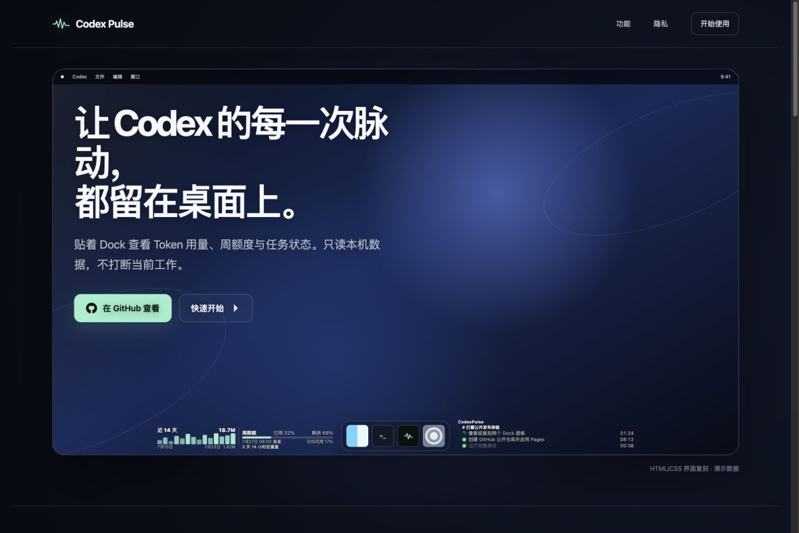
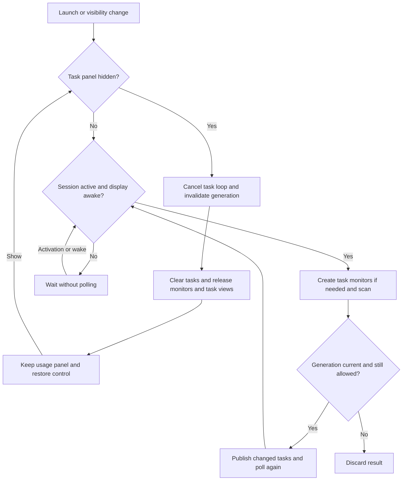

# Codex Pulse

<p align="center">
  <a href="README.md">English</a> ·
  <a href="README.zh-CN.md">簡體中文</a> ·
  <strong>繁體中文（香港）</strong> ·
  <a href="README.zh-TW.md">繁體中文（台灣）</a> ·
  <a href="README.ja.md">日本語</a> ·
  <a href="README.ko.md">한국어</a>
</p>

Codex Pulse 是一款 macOS 26+ 桌面配件應用程式，在 Dock 旁顯示本機 Codex、Claude Code 及 OpenCode 的用量與任務活動。應用程式以 SwiftUI 及 AppKit 建構，讀取本機記錄，不會上傳用量資料，也不會修改原始記錄。

<p align="center">
  <a href="https://iwecon.github.io/CodexPulse/">
    
  </a>
</p>

[產品頁面及互動式示範](https://iwecon.github.io/CodexPulse/) · [下載發佈版本](https://github.com/iwecon/CodexPulse/releases/latest)

## 安裝

在 macOS 26 或以上版本，從 Releases 下載適用於你的 Mac 的 DMG：Apple 晶片使用 `Codex-Pulse-arm64.dmg`，Intel 使用 `Codex-Pulse-x86_64.dmg`。開啟後將 `Codex Pulse.app` 複製到「應用程式」資料夾。

安裝 Homebrew 後，也可使用此儲存庫的 tap：

```bash
brew tap iwecon/codex-pulse https://github.com/iwecon/CodexPulse
brew install --cask iwecon/codex-pulse/codex-pulse
```

另一種安裝方式需要 Node.js 18+ 及 npm：

```bash
npm install -g github:iwecon/CodexPulse
codex-pulse install
codex-pulse open
```

npm 指令可從任何目錄執行。單獨安裝 CLI 並不會安裝應用程式；`codex-pulse install` 會下載並掛載發佈版 DMG，然後將應用程式複製到 `~/Applications/Codex Pulse.app`。加上 `--force` 可取代現有安裝。支援的指令請參閱[安裝程式 CLI](npm/bin/codex-pulse.js)。

## 使用面板

連接多個顯示器時，兩個面板固定在系統主顯示器，不會跟隨滑鼠或取得焦點的視窗切換螢幕。更改主顯示器或連接、中斷連接顯示器後，面板會自動重新定位。

應用程式沒有 Dock 圖示。其透明面板會停留於桌面圖示上方及一般應用程式視窗下方，跟隨 Dock 位於底部、左側或右側的擺放方式，並支援多個 Space。

| 面板 | 顯示內容 |
| --- | --- |
| **用量概覽面板**（Usage Overview Panel） | 最近 14 天的 token 趨勢及每項工具的總量，並在有資料時顯示 Codex 每週限額。該時段沒有用量的工具會自動隱藏。 |
| **任務活動面板**（Task Activity Panel） | 三項工具的進行中及最近任務，按專案及工作階段分組，並顯示狀態指示及最新使用者訊息。 |

預設情況下，底部 Dock 左側顯示用量，右側顯示任務；Dock 垂直放置時，用量顯示在任務上方。即使你移動面板，這些名稱仍代表其職責。

底部 Dock 某側的剩餘空間不足以容納面板設定寬度時，該側面板會自動移到 Dock 上方，保留左右位置和堆疊次序；空間恢復後自動回到 Dock 旁。

每週額度預設顯示在用量右側。位置按鈕按右側、上方、下方、左側循環切換，並獨立儲存選擇，不受面板在螢幕上的位置影響。上方或下方排列會增加面板高度；隱藏每週額度或沒有額度資料時，會收起額外空間並隱藏位置按鈕。

將指標在面板內保持靜止半秒即可顯示控制項。拖動調整大小的邊緣或使用按鈕，可以移動面板並更改其堆疊次序。用量概覽面板亦提供語言選擇、每項工具的用量列顏色、每週限額顯示及相片牆紙權限；任務活動面板提供文字對齊及隱藏按鈕。偏好設定會儲存在本機。介面支援簡體中文、香港及台灣繁體中文、日文、韓文和英文；首次啟動預設使用簡體中文。

一般內容支援點擊穿透。Codex 工作階段標題會在 ChatGPT 開啟相應的對話；Claude Code 及 OpenCode 標題保持點擊穿透。文字會因應各面板下方的牆紙自動調整。取樣使用本機資產，從不擷取螢幕；相片圖庫牆紙會使用現有存取權限，只有你透過控制項明確要求時才會請求權限。無法使用的牆紙資產會退回系統外觀，不會下載圖片。

只有 Codex 提供本機限額快照。剩餘限額為 `100 - used_percent`，使用最新的帳戶級記錄。頁尾的每週 token 總量是估算值：`本限額週期記錄的 token 數 ÷ used_percent × 100`，使用原始已用百分比計算。這不是官方 token 限額，亦可能遺漏其他裝置或雲端工作階段的活動；輸入缺失或無效時會保留只顯示已用量的顯示方式。將指標移到每週限額顯示/隱藏控制項上可查看說明。

Codex 回合在 3 分鐘沒有日誌活動後會顯示為暫停，並於最後一次活動後 10 分鐘過期；新活動只會恢復由靜默推斷出的暫停。已完成、明確暫停及已終止的任務會保留 10 分鐘。Claude Code 及 OpenCode 會從本機記錄推斷回合，並在工作階段超過 12 分鐘沒有活動後移除仍在執行的回合。因此，長時間沒有輸出的工具呼叫可能暫時顯示為暫停或消失。

非 Debug 的 `.app` 會在首次啟動時設定登入時啟動，並尊重你之後在系統設定中停用的設定。Debug 建置及原始可執行檔（包括 `swift run`）不會改動登入項目。

## 本機資料及重新整理

除了在本機按標準資料位置使用受支援的工具外，無需 API 金鑰或資料來源設定：

| 資料來源 | 讀取的記錄 |
| --- | --- |
| Codex 用量 | `~/.codex/sessions/**/*.jsonl`、`~/.codex/archived_sessions/**/*.jsonl` |
| Codex 任務索引 | `~/.codex/state_*.sqlite` 及其引用的工作階段日誌 |
| Claude Code 用量及任務 | `~/.claude/projects/**/*.jsonl` |
| OpenCode 用量及任務 | `~/.local/share/opencode/opencode.db`，包括 WAL/SHM 變更偵測 |

缺失或無法讀取的資料來源只會影響相應工具。用量彙總涵蓋可見的 14 天視窗，衍生資料只保留在記憶體中。冷啟動掃描會篩選相關檔案及資料列；後續掃描重用記憶體狀態並處理新增或變更內容。JSONL 會以分塊方式讀取，不會建立衍生用量資料庫或磁碟快取。工作階段未處於活動狀態或顯示器進入睡眠時，用量及任務重新整理，以及任務狀態動畫都會暫停；兩項條件都解除後才會恢復。

### 隱藏及還原任務活動

在任務活動面板的控制項中選擇 **隱藏任務活動面板**，然後在用量概覽面板中選擇 **顯示任務活動面板** 以還原。隱藏設定會跨啟動保留，會取消任務監察、清除任務，並在已取消的讀取操作結束後釋放只供任務使用的快取。它亦會移除任務檢視、連結、控制項及牆紙取樣區域。用量掃描保持獨立，仍可能讀取相同日誌。還原時會保留面板偏好設定並掃描目前記錄；隱藏期間的時間仍會計入過期時間。



[UsageModel.swift](Sources/CodexPulse/UsageModel.swift) 負責重新整理條件和掃描結果的有效性；[TaskMonitoringSession.swift](Sources/CodexPulse/TaskMonitoringSession.swift) 負責三個任務監察器。隱藏啟動時不會啟動任務監察。釋放物件並不保證可回收的配置器頁面會立即從程序記憶體佔用中消失。

## 開發及驗證

使用 macOS 26+、Xcode 26+ 及已選取的 Swift 6.2+ 工具鏈，並使用系統 SQLite 3 程式庫。這個 [Swift 套件](Package.swift) 沒有外部套件依賴。請從儲存庫根目錄執行以下指令：

```bash
swift build
swift run "Codex Pulse"
swift test
```

對於 Debug `.app`，請從儲存庫根目錄使用 `./script/build_and_run.sh`。它會停止現有的 `Codex Pulse` 程序，重新建置 `dist/Codex Pulse Debug.app` 並啟動它。該指令碼亦支援 `--debug`、`--logs`、`--telemetry` 及 `--verify`；詳情請參閱[該指令碼](script/build_and_run.sh)。

[測試套件](Tests/CodexPulseTests)涵蓋剖析器、增量掃描、限額計算、任務生命週期、面板幾何、牆紙行為、本地化及登入資格。[AGENTS.md](AGENTS.md)記錄專案約束，以及需要執行完整測試套件或進行 UI 與記憶體檢查的變更。

如需針對本機工作階段進行可選的唯讀任務記憶體檢查，請從儲存庫根目錄執行：

```bash
CODEXPULSE_LOCAL_TASK_MEMORY=1 swift test --filter TaskMonitoringMemoryTests
```

普通測試套件會略過此探測。它會在三個可見性週期內檢查監察器釋放及隱藏時的輪詢，並分別報告實體記憶體佔用與物件生命週期。

## 程式碼導覽

| 區域 | 入口 |
| --- | --- |
| 應用程式及面板控制 | [App.swift](Sources/CodexPulse/App.swift)、[DockPanelResizing.swift](Sources/CodexPulse/DockPanelResizing.swift)、[CodexSessionLink.swift](Sources/CodexPulse/CodexSessionLink.swift) |
| 用量彙總及模型 | [UsageScanner.swift](Sources/CodexPulse/UsageScanner.swift)、[Models.swift](Sources/CodexPulse/Models.swift) |
| 重新整理及任務生命週期 | [UsageModel.swift](Sources/CodexPulse/UsageModel.swift)、[TaskMonitoringSession.swift](Sources/CodexPulse/TaskMonitoringSession.swift)、[RefreshActivityGate.swift](Sources/CodexPulse/RefreshActivityGate.swift) |
| 牆紙外觀 | [WallpaperAppearance.swift](Sources/CodexPulse/WallpaperAppearance.swift)、[WallpaperSourceResolver.swift](Sources/CodexPulse/WallpaperSourceResolver.swift)、[AdaptiveTextColor.swift](Sources/CodexPulse/AdaptiveTextColor.swift) |
| 偏好設定及啟動 | [AppLanguage.swift](Sources/CodexPulse/AppLanguage.swift)、[ToolBarColorSettings.swift](Sources/CodexPulse/ToolBarColorSettings.swift)、[LaunchAtLoginManager.swift](Sources/CodexPulse/LaunchAtLoginManager.swift) |
| 產品網站及發佈 | [docs/index.html](docs/index.html)、[Homebrew cask](Casks/codex-pulse.rb)、[npm package](package.json)、[release workflow](.github/workflows/release.yml) |

## 打包及發佈

如需本機打包，請在具備上述開發先決條件的情況下從儲存庫根目錄執行，選擇 `arm64` 或 `x86_64`，並將 `X.Y.Z` 替換為數字版本號：

```bash
./script/package_release.sh --arch arm64 --version X.Y.Z --output dist
```

這會建置發佈版應用程式並寫入 `dist/Codex-Pulse-arm64.dmg`，不會發佈它。本機打包預設使用 ad hoc 簽署。[打包指令碼](script/package_release.sh)接受 `--signing-identity` 及可選的 `--signing-keychain` 以進行 Developer ID 簽署，並會拒絕非系統動態依賴，包括外部 SQLite 程式庫。

推送 `vX.Y.Z` 標籤或手動派送[發佈工作流程](.github/workflows/release.yml)時，工作流程會建置兩種架構，並建立或更新公開的 GitHub Release，當中包含 DMG 及 `SHA256SUMS`。CI 需要 Developer ID Application 憑證/私鑰以及 App Store Connect API 金鑰來進行簽署、公證及裝訂；確切的儲存庫密鑰名稱與驗證步驟定義於該工作流程中。有提供時，精選說明來自 `.github/release-notes/vX.Y.Z.md`。可選的 npm 發佈由 `PUBLISH_NPM=true` 和 `NPM_TOKEN` 控制。這些操作會發佈構建產物並需要發佈憑證；上面的指令只涉及本機開發和打包。
