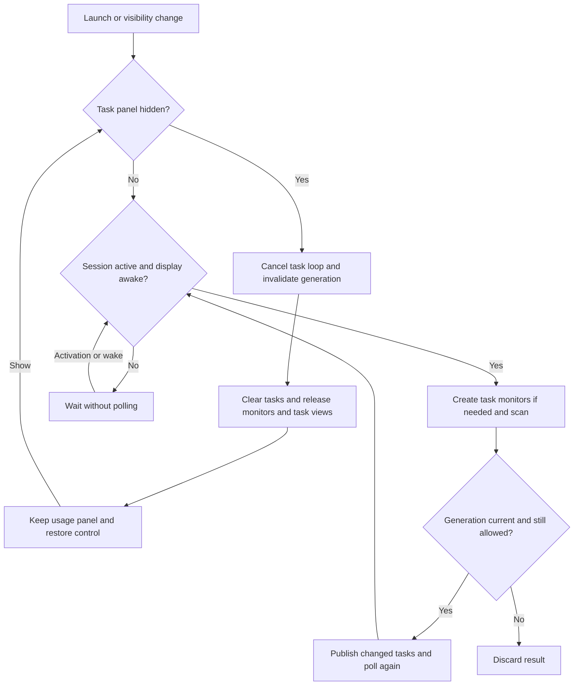

# Codex Pulse

<p align="center">
  <a href="README.md">English</a> ·
  <a href="README.zh-CN.md">簡體中文</a> ·
  <a href="README.zh-HK.md">繁體中文（香港）</a> ·
  <strong>繁體中文（台灣）</strong> ·
  <a href="README.ja.md">日本語</a> ·
  <a href="README.ko.md">한국어</a>
</p>

Codex Pulse 是一款 macOS 26+ 桌面輔助應用程式，在 Dock 旁顯示本機 Codex、Claude Code 與 OpenCode 的用量與任務活動。它使用 SwiftUI 與 AppKit 建置，讀取本機紀錄，不會上傳用量資料，也不會修改原始紀錄。

<p align="center">
  <a href="https://iwecon.github.io/CodexPulse/">
    
  </a>
</p>

[產品頁面與互動式示範](https://iwecon.github.io/CodexPulse/) · [下載發行版](https://github.com/iwecon/CodexPulse/releases/latest)

## 安裝

在 macOS 26 或以上版本，從 Releases 下載適用於你的 Mac 的 DMG：Apple Silicon 使用 `Codex-Pulse-arm64.dmg`，Intel 使用 `Codex-Pulse-x86_64.dmg`。開啟後將 `Codex Pulse.app` 複製到「應用程式」資料夾。

安裝 Homebrew 後，也可以使用此儲存庫的 tap：

```bash
brew tap iwecon/codex-pulse https://github.com/iwecon/CodexPulse
brew install --cask iwecon/codex-pulse/codex-pulse
```

另一種安裝方式需要 Node.js 18+ 與 npm：

```bash
npm install -g github:iwecon/CodexPulse
codex-pulse install
codex-pulse open
```

npm 指令可從任何目錄執行。單獨安裝 CLI 並不會安裝應用程式；`codex-pulse install` 會下載並掛載發行版 DMG，然後將應用程式複製到 `~/Applications/Codex Pulse.app`。加上 `--force` 可取代現有安裝。支援的指令請參閱[安裝程式 CLI](npm/bin/codex-pulse.js)。

## 使用面板

連接多個顯示器時，兩個面板固定在系統主顯示器，不會跟隨滑鼠或取得焦點的視窗切換螢幕。變更主顯示器或連接、中斷連接顯示器後，面板會自動重新定位。

應用程式沒有 Dock 圖示。透明面板會保持在桌面圖示上方及一般應用程式視窗下方，跟隨 Dock 位於底部、左側或右側的排列方式，並支援多個 Space。

| 面板 | 顯示內容 |
| --- | --- |
| **用量概覽面板**（Usage Overview Panel） | 最近 14 天的 token 趨勢與各工具總量，以及可用時的 Codex 每週配額。這段期間沒有用量的工具會自動隱藏。 |
| **任務活動面板**（Task Activity Panel） | 三種工具目前與最近的任務，依專案與工作階段分組，並顯示狀態指示與最新使用者訊息。 |

預設情況下，底部 Dock 左側顯示用量，右側顯示任務；Dock 垂直放置時，用量顯示在任務上方。即使你移動面板，這些名稱仍代表各自的職責。

底部 Dock 某側的剩餘空間不足以容納面板設定寬度時，該側面板會自動移到 Dock 上方，保留左右位置和堆疊順序；空間恢復後自動回到 Dock 旁。

每週額度預設顯示在用量右側。位置按鈕依右側、上方、下方、左側循環切換，並獨立儲存選擇，不受面板在螢幕上的位置影響。上方或下方排列會增加面板高度；隱藏每週額度或沒有額度資料時，會收起額外空間並隱藏位置按鈕。

將指標停留在面板內半秒即可顯示控制項。拖曳調整大小的邊緣或使用按鈕，可移動面板並變更堆疊順序。用量概覽面板也提供語言選擇、各工具用量列顏色、每週配額顯示與照片桌布權限；任務活動面板提供文字對齊與隱藏按鈕。偏好設定會儲存在本機。介面支援簡體中文、香港與台灣繁體中文、日文、韓文與英文；首次啟動預設使用簡體中文。

一般內容可點擊穿透。Codex 工作階段標題會在 ChatGPT 中開啟對應的對話；Claude Code 與 OpenCode 標題保持點擊穿透。文字會依據各面板下方的桌布自動調整。取樣使用本機資產，從不擷取螢幕；照片圖庫桌布會使用現有的存取權限，只有你透過控制項明確要求時才會請求權限。無法使用的桌布資產會退回系統外觀，不會下載圖片。

只有 Codex 提供本機配額快照。剩餘配額為 `100 - used_percent`，使用最新的帳戶層級記錄。頁尾的每週 token 總量是估算值：`本配額週期記錄的 token 數 ÷ used_percent × 100`，使用原始已用百分比計算。這不是官方 token 配額，且可能遺漏其他裝置或雲端工作階段的活動；輸入缺少或無效時保留只顯示已用量的畫面。將指標停留在每週配額顯示/隱藏控制項上可查看說明。

Codex 回合在 3 分鐘沒有日誌活動後會顯示為暫停，並在最後一次活動後 10 分鐘過期；新的活動只會讓由靜默推斷出的暫停恢復。已完成、明確暫停及已終止的任務會保留 10 分鐘。Claude Code 與 OpenCode 會從本機紀錄推斷回合，並在工作階段超過 12 分鐘沒有活動後移除執行中的回合。因此，長時間沒有輸出的工具呼叫可能暫時顯示為暫停或消失。

非 Debug 的 `.app` 會在首次啟動時設定登入時啟動，並遵循你之後在系統設定中停用的選擇。Debug 建置和原始可執行檔（包括 `swift run`）不會變更登入項目。

## 本機資料與重新整理

除了在本機依標準資料位置使用支援的工具外，不需要 API 金鑰或來源設定：

| 資料來源 | 讀取的記錄 |
| --- | --- |
| Codex 用量 | `~/.codex/sessions/**/*.jsonl`、`~/.codex/archived_sessions/**/*.jsonl` |
| Codex 任務索引 | `~/.codex/state_*.sqlite` 及其參照的工作階段日誌 |
| Claude Code 用量與任務 | `~/.claude/projects/**/*.jsonl` |
| OpenCode 用量與任務 | `~/.local/share/opencode/opencode.db`，包括 WAL/SHM 變更偵測 |

缺少或無法讀取的資料來源只會影響對應工具。用量彙總涵蓋可見的 14 天視窗，衍生資料只保留在記憶體中。冷啟動掃描會篩選相關檔案與資料列；後續掃描重用記憶體狀態並處理新增或變更內容。JSONL 採分塊方式讀取，不會建立衍生用量資料庫或磁碟快取。工作階段未處於活動狀態或顯示器進入睡眠時，用量與任務重新整理及任務狀態動畫都會暫停；兩項條件都解除後才會恢復。

### 隱藏與還原任務活動

在任務活動面板的控制項中選取 **隱藏任務活動面板**，然後在用量概覽面板中選取 **顯示任務活動面板** 即可還原。隱藏設定會跨啟動保留，會取消任務監控、清除任務，並在取消的讀取結束後釋放僅供任務使用的快取。它也會移除任務檢視、連結、控制項及桌布取樣區域。用量掃描保持獨立，仍可能讀取相同的日誌。還原時會保留面板偏好設定並掃描目前的記錄；隱藏期間的時間仍會計入過期時間。



[UsageModel.swift](Sources/CodexPulse/UsageModel.swift) 負責重新整理條件和掃描結果的有效性；[TaskMonitoringSession.swift](Sources/CodexPulse/TaskMonitoringSession.swift) 負責三個任務監控器。隱藏啟動時不會啟動任務監控。物件釋放不代表可回收的配置器頁面會立即從程序的實體記憶體佔用中消失。

## 開發與驗證

使用 macOS 26+、Xcode 26+ 與已選取的 Swift 6.2+ 工具鏈，並使用系統 SQLite 3 程式庫。這個 [Swift 套件](Package.swift) 沒有外部套件相依性。請從儲存庫根目錄執行以下指令：

```bash
swift build
swift run "Codex Pulse"
swift test
```

對於 Debug `.app`，請從儲存庫根目錄使用 `./script/build_and_run.sh`。它會停止現有的 `Codex Pulse` 程序，重新建置 `dist/Codex Pulse Debug.app` 並啟動它。此指令碼也支援 `--debug`、`--logs`、`--telemetry` 和 `--verify`；詳情請參閱[該指令碼](script/build_and_run.sh)。

[測試套件](Tests/CodexPulseTests)涵蓋剖析器、增量掃描、配額計算、任務生命週期、面板幾何、桌布行為、本地化與登入資格。[AGENTS.md](AGENTS.md)記錄專案限制，以及需要執行完整測試套件或進行 UI 和記憶體檢查的變更。

如要針對本機工作階段執行選擇性的唯讀任務記憶體檢查，請從儲存庫根目錄執行：

```bash
CODEXPULSE_LOCAL_TASK_MEMORY=1 swift test --filter TaskMonitoringMemoryTests
```

一般測試套件會略過此探測。它會在三個可見性週期內檢查監控器是否釋放，以及隱藏時是否輪詢，並分別回報實體記憶體佔用與物件生命週期。

## 程式碼導覽

| 區域 | 入口 |
| --- | --- |
| 應用程式與面板控制 | [App.swift](Sources/CodexPulse/App.swift)、[DockPanelResizing.swift](Sources/CodexPulse/DockPanelResizing.swift)、[CodexSessionLink.swift](Sources/CodexPulse/CodexSessionLink.swift) |
| 用量彙總與模型 | [UsageScanner.swift](Sources/CodexPulse/UsageScanner.swift)、[Models.swift](Sources/CodexPulse/Models.swift) |
| 重新整理與任務生命週期 | [UsageModel.swift](Sources/CodexPulse/UsageModel.swift)、[TaskMonitoringSession.swift](Sources/CodexPulse/TaskMonitoringSession.swift)、[RefreshActivityGate.swift](Sources/CodexPulse/RefreshActivityGate.swift) |
| 桌布外觀 | [WallpaperAppearance.swift](Sources/CodexPulse/WallpaperAppearance.swift)、[WallpaperSourceResolver.swift](Sources/CodexPulse/WallpaperSourceResolver.swift)、[AdaptiveTextColor.swift](Sources/CodexPulse/AdaptiveTextColor.swift) |
| 偏好設定與啟動 | [AppLanguage.swift](Sources/CodexPulse/AppLanguage.swift)、[ToolBarColorSettings.swift](Sources/CodexPulse/ToolBarColorSettings.swift)、[LaunchAtLoginManager.swift](Sources/CodexPulse/LaunchAtLoginManager.swift) |
| 產品網站與發佈 | [docs/index.html](docs/index.html)、[Homebrew cask](Casks/codex-pulse.rb)、[npm package](package.json)、[release workflow](.github/workflows/release.yml) |

## 打包與發佈

如需本機打包，請在具備上述開發先決條件的情況下從儲存庫根目錄執行，選擇 `arm64` 或 `x86_64`，並將 `X.Y.Z` 替換為數字版本號：

```bash
./script/package_release.sh --arch arm64 --version X.Y.Z --output dist
```

這會建置發行版應用程式並寫入 `dist/Codex-Pulse-arm64.dmg`，不會發佈它。本機打包預設使用 ad hoc 簽署。[打包指令碼](script/package_release.sh)接受 `--signing-identity` 與可選的 `--signing-keychain` 以進行 Developer ID 簽署，並會拒絕非系統動態相依性，包括外部 SQLite 程式庫。

推送 `vX.Y.Z` 標籤或手動執行[發佈工作流程](.github/workflows/release.yml)時，工作流程會建置兩種架構，並建立或更新公開的 GitHub Release，內含 DMG 與 `SHA256SUMS`。CI 需要 Developer ID Application 憑證/私鑰以及 App Store Connect API 金鑰，以進行簽署、公證及裝訂；確切的儲存庫密鑰名稱與驗證步驟定義於該工作流程中。有提供時，精選說明來自 `.github/release-notes/vX.Y.Z.md`。可選的 npm 發佈由 `PUBLISH_NPM=true` 和 `NPM_TOKEN` 控制。這些操作會發佈建置成果並需要發佈憑證；上面的指令只涉及本機開發與打包。
